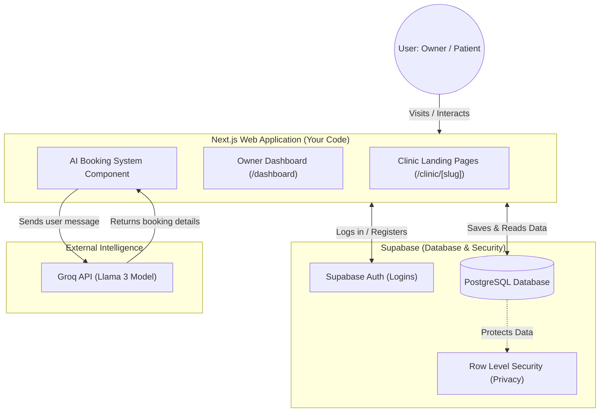
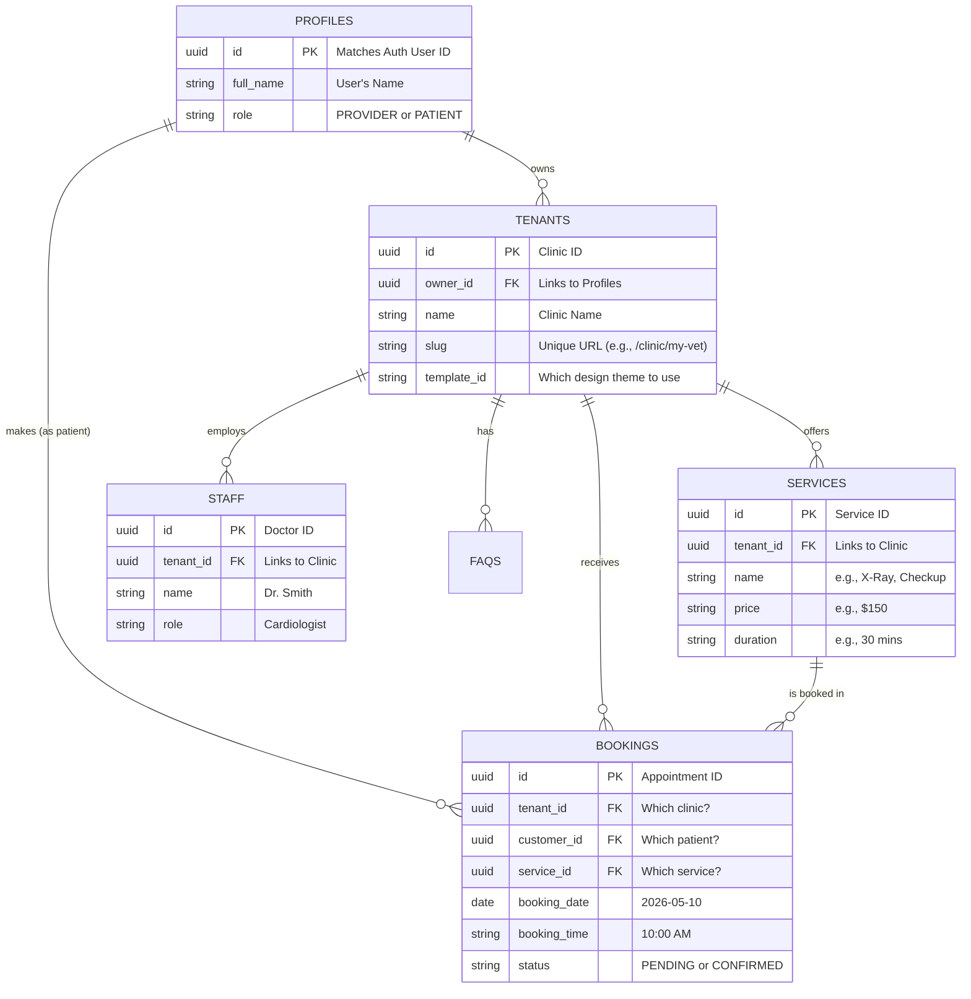
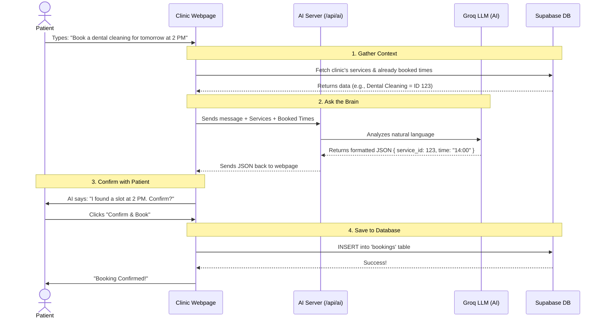
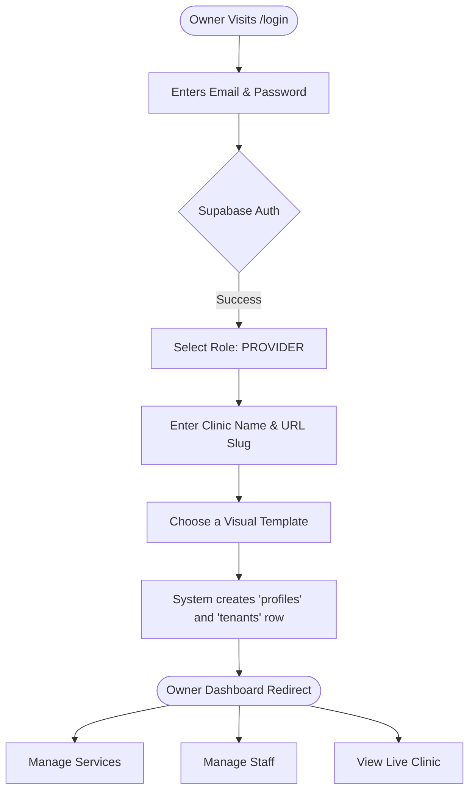

# FlexSlot SaaS System Design Documentation

It is completely understandable to feel overwhelmed. When a project grows, the codebase can become very complex. Taking a step back to understand the **"Big Picture"** through diagrams is exactly what professional software architects do. 

Below is the complete design documentation for your FlexSlot platform. These diagrams explain how the data flows, how the database is structured, and how the different pieces communicate.

---

## 1. High-Level System Architecture

This diagram shows the main "building blocks" of your project. Think of it as a map of the city.

- **Next.js (Frontend)**: The visual part the user sees (the Dashboard and the Clinic landing pages).
- **Supabase (Backend)**: Where your data and user accounts are securely stored.
- **Groq (AI)**: The "brain" that understands what the patient types in the chat.

---

## 2. Entity-Relationship Diagram (ERD)

The ERD is the blueprint of your database. It shows all the "Tables" (Entities) and how they connect to each other. 
- The lines connecting the boxes show relationships. For example, one `TENANT` (Clinic) can have many `SERVICES`.
- `PK` means Primary Key (the unique ID).
- `FK` means Foreign Key (a link to another table's ID).

---

## 3. The AI Booking Flow (Sequence Diagram)

This is a step-by-step flowchart of what exactly happens when a patient visits a clinic's URL and tries to book an appointment using the AI chat.

---

## 4. Owner Onboarding Flowchart

This shows the journey of a new Doctor/Clinic Owner signing up for your platform for the first time.

---

## What documents should a project like this have?

To keep your project organized and understandable, a professional software project usually maintains the following core documents (which you can create as markdown files in a `docs/` folder):

1. **`README.md`**: The front page. Explains what the project is, how to install it (`npm install`), and how to run it (`npm run dev`).
2. **`ARCHITECTURE.md`**: Contains the diagrams I generated above so any new developer can understand the big picture instantly.
3. **`DATABASE_SCHEMA.md`**: The exact SQL commands used to create the database (like the ones I provided you earlier).
4. **`API_ROUTES.md`**: A list of backend endpoints (like your `/api/ai` route), what data they expect, and what they return.
5. **`USER_MANUAL.md`**: A simple guide for your end-users (the clinic owners) on how to use their dashboard.

Keeping these documents updated ensures that you never feel lost, even if you take a month off from coding!
